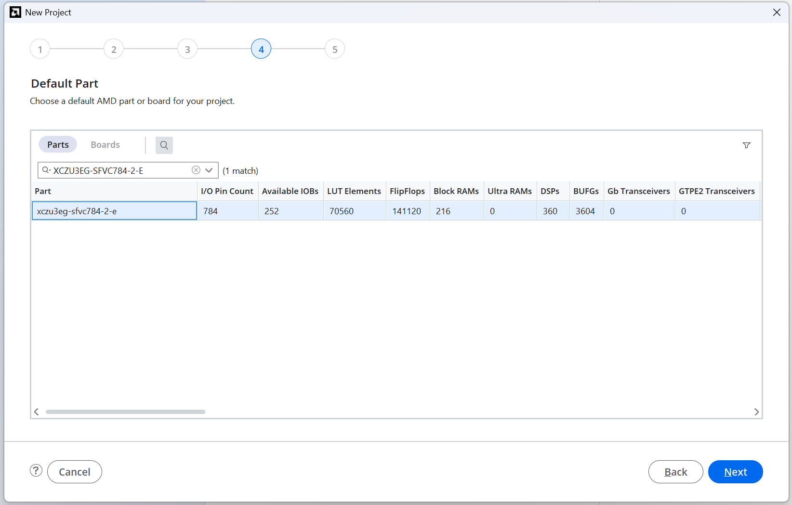
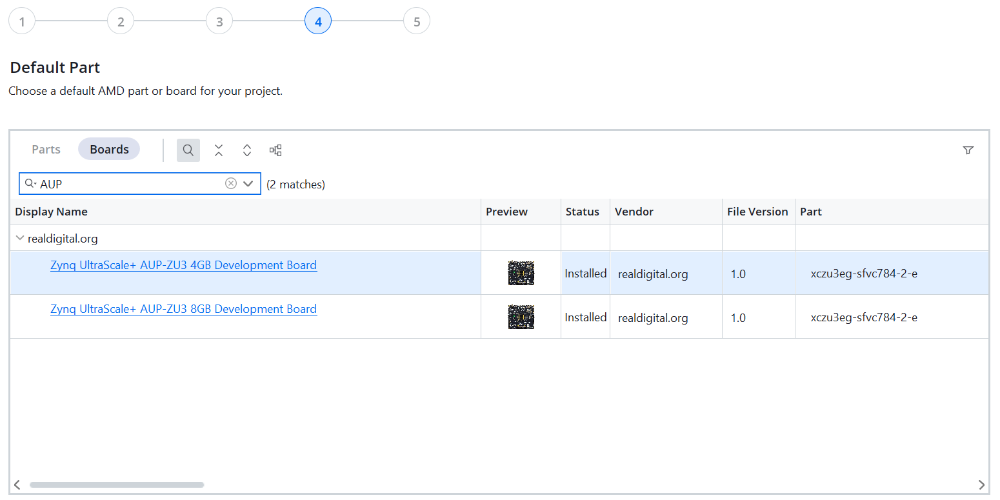
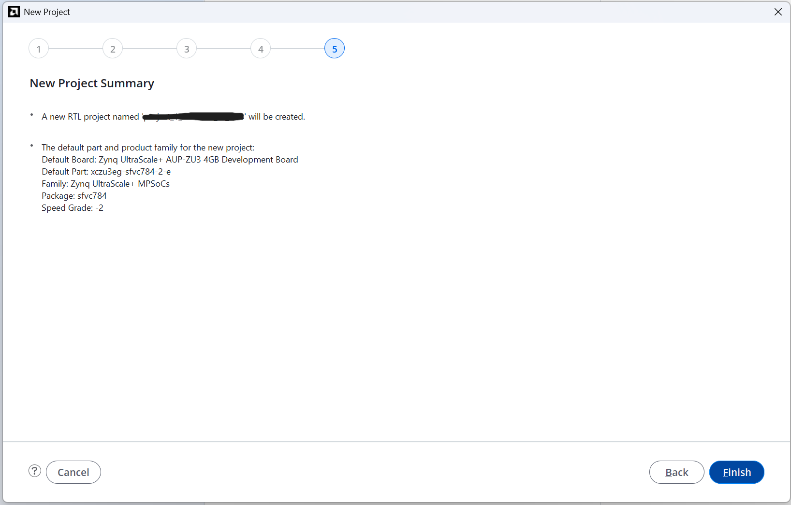

# Getting Started with FPGAs
Follows the book "GETTING STARTED WITH FPGAS" by "Russell Merrick", hereafter referred to as the book.

FPGA used: AMD (Xilinx) `AUP-ZU3` (Real Digital) <br>
Device Name (Default Part Name): `XCZU3EG-SFVC784-2-E` <br>
Tool Used: `Vivado 2025.2` (free tier) on Windows 11 Home <br>

General Rules: 
1. Following Little Endianness - LSB is the bit with lowest index value
2. All the code is in SystemVerilog (its a superset of Verilog and verilog code will also work)
3. All the constraint files are  in `.xdc` format - for compatibility to Vivado and added before running synthesis
4. Optional Testbenches are used to ensure functionality before programming the FPGA to ensure that Hardware is not damaged in the process
5. Referenced the zu3.xdc file from realdigital.org for the AUP-ZU3 Board to write the constraint files
6. Preference to Synchronous resets as mentioned in AMD Documentation
7. Will make use vio and ila, wherever needed. Have decided not to use it for the basic projects. 

---

## Starting a new Project

Open Vivado


Start a New Project: give the project name, select the directory/ location, and if you want to create a new sub-directory for the project


Select Project type, I have selected to add my sources later


Select the default part (board or the silicon) <br> 
Since I did not want to add the sources at this stage, the tool skipped step 3


You either select the part or the board, not both. If you have not added board files to vivado or are having trouble with it. you can safely use the part selection, over the board selection. I will be using the board selection for my projects.


Check if everything is summarised correctly at the last step before finishing and starting to work in the project



---

## Project-1: Wiring Switches to LEDs 

When you press one of the push button switches, one of the LEDs should light up. 

``` Project Structure
project_1.srcs
|---- constrs_1/new/pins.xdc
|---- sources_1/new/Switches_To_LEDs.sv
```

### Design Decisions:
Made use of vector assignment available in system verilog instead of using 4 different assign statements <br>
Kept 4 different ports for input and output each instead of taking them as vectors <br>
Naming change: Used the values go from 3 down to 0, instead of 4 to 1 <br>
Use Push Buttons for input port <br>
Use LEDs for the output ports <br>

Reference: Project#1, Chapter-2 of the book

---

## Project-2: Lighting an LED with Logic Gates

When you change input through slide switches, the output changes, according to the logic

``` Project Structure
project_2.srcs
|---- constrs_1/new/pins.xdc
|---- sim_1/new/And_Gate_Project_tb.sv
|---- sources_1/new/And_Gate_Project.sv
```

### Design Decisions
Implement `and`, `xor` gates instead of just and gate for more fun <br>
The ouputs follow the following order going from leftmost (msb) led to the rightmost (lsb) led [XOR, AND] <br>

Reference: Project#2, Chapter-3 of the book
Reference (Testbench): page 72, Chapter-5 of the book

---

## Project-3: Blinking an LED

``` Project Structure
project_3_new.srcs
|---- constrs_1/new/io_pins.xdc
|---- sources_1/new/LED_Toggle.sv
|---- sources_1/new/top.sv
|---- sources_1/ip/clk_wiz_0/clk_wiz_0.xci
```

### Design Decisions
Uses a Clocking Wizard IP to divide the 100MHz board clock down to 10MHz. <br>
Used the board schematics from real digital website for internal clock properties clk_p at pin D7, with LVDS Voltage, and 100MHz frequency diff_clk <br>
Used a `top.sv` module to connect on board clk, the clocking wizard ip, and the actual design together, and also wrote the constraint file accordingly <br>
Also, wait for the clock to stabalize, before allowing input changes (`i_btn && clk_lock`) 
Use Push Buttons for input port (toggle of the led)
Use LED for output port

Reference: Project#3, Chapter-4 of the book

---

<!-- ## Project-4 

``` Project Structure
```
### Design Decisions

Reference: Project#4, Chapter-5 of the book
 -->


---

## Planned additions: 
per-project READMEs with resource utilization reports and implementation images.