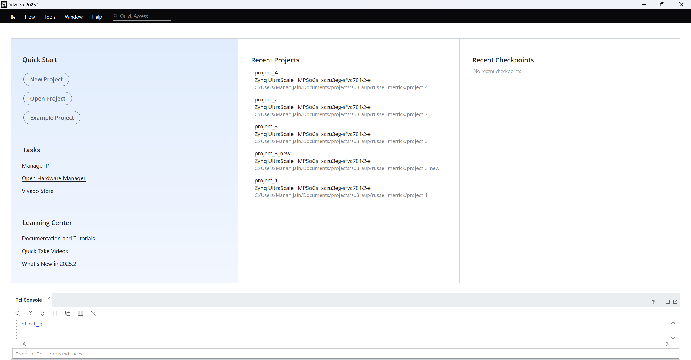
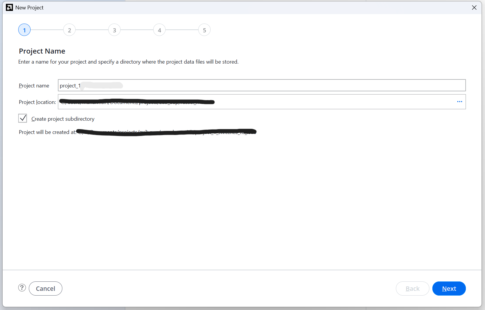
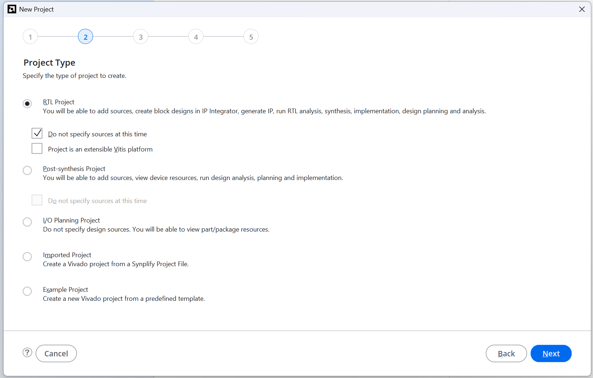

# Getting_Started_with_FPGAs
Follows the book "GETTING STARTED WITH FPGAS" by "Russell Merrick"

FPGA being used: AMD (Xilinx) AUP-ZU3 (Real Digital)
Device Name (Default Part Name): XCZU3EG-SFVC784-2-E
Tool Used: Vivado 2025.2 (free tier) on Windows 11 Home

General Rules: 
1. Following Little Endianness - LSB is the bit with lowest index value
2. All the code is in SystemVerilog (its a superset of Verilog and verilog code will also work)
3. All the constraint files are  in .xdc format - for compatibility to Vivado and added before running synthesis
4. Optional Testbenches are used to ensure functionality before programming the FPGA to ensure that Hardware is not damaged in the process
5. Referenced the zu3.xdc file from realdigital.org for the AUP-ZU3 Board to write the constraint files
6. Preference to Synchronous resets as mentioned in AMD Documentation

---

## Starting a new Project

---

## Project-1: Wiring Switches to LEDs 

## Project-2: Lighting an LED with Logic Gates

## Project-3: Blinking an LED