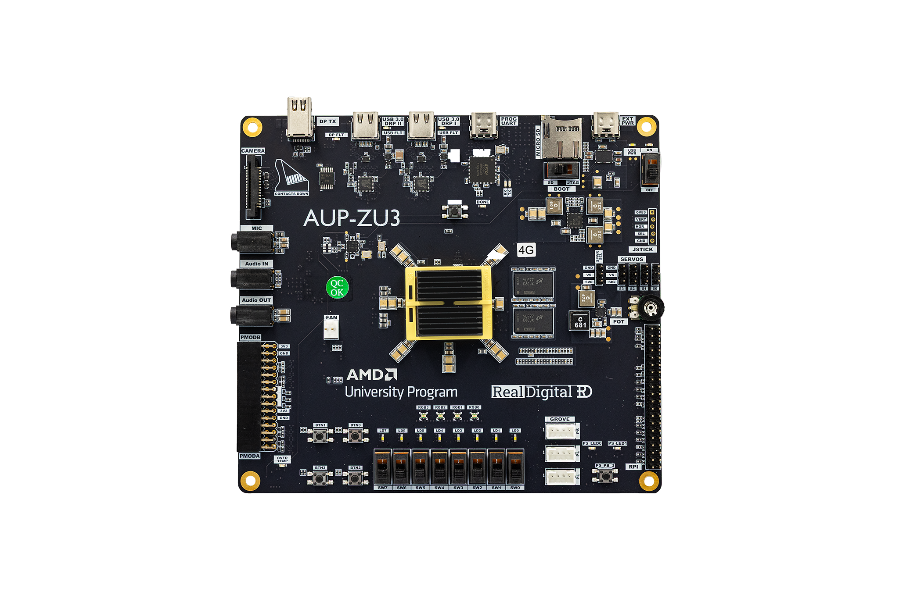

<!-- markdownlint-disable-file MD033 MD013 MD003-->
# Getting Started with FPGAs

Follows the book "GETTING STARTED WITH FPGAS" by "Russell Merrick", hereafter referred to as the book.

FPGA used: AMD (Xilinx) `AUP-ZU3` (Real Digital) <br>
Device Name (Default Part Name): `XCZU3EG-SFVC784-2-E` <br>
Tool Used:  `Vivado 2025.2` (free tier) on Windows 11 Home

Other Tools: [DigitalJS](https://digitaljs.tilk.eu/), [RapidRTL](https://www.rapidrtl.com/) as online compilers to check design synthesis/schematics for ASICs for comparision wherever needed.

AUP-ZU3 Board:


General Rules:

1. Following Little Endianness - LSB is the bit with lowest index value
2. All the code is in SystemVerilog (its a superset of Verilog and verilog code will also work)
3. All the constraint files are  in `.xdc` format - for compatibility to Vivado and added before running synthesis
4. Optional Testbenches are used to ensure functionality before programming the FPGA to ensure that Hardware is not damaged in the process
5. Referenced the [zu3.xdc](/docs/zu3.xdc) file from realdigital.org for the AUP-ZU3 Board to write the constraint files
6. Preference to Synchronous resets as mentioned in AMD Documentation
7. Will make use vio (virtual input and output) and ILA (integrated Logic Analyzer), wherever needed. Have decided not to use it for the basic projects.
8. Preference to built in Clocking Wizard for changing clock frequency.

---

## Starting a new Project

Open Vivado


Start a New Project: give the project a name, select the directory or location, and whether you want to create a new sub-directory for the project or not.


Select Project type: RTL Project. I have selected to add my sources later


Select the default part (board or the silicon) <br>
Since I did not want to add the sources at this stage, the tool skipped step 3


You either select the part or the board, not both. <br> If you have not added board files to vivado or are having trouble with it, you can safely use the part selection, over the board selection.

I will be using the board selection for my projects.

Check if everything is summarised correctly at the last step before finishing and starting to work in the project


---

<!-- ## Project-1: Wiring Switches to LEDs -->
## [Project-1: Wiring Switches to LEDs](project_1/README.md)

When you press one of the push button switches, one of the LEDs should light up.

Project Structure

```txt
project_1.srcs
|---- sources_1/new/Switches_To_LEDs.sv     # top level design
|---- constrs_1/new/pins.xdc        # constraint file
```

---

<!-- ## Project-2: Lighting an LED with Logic Gates -->
## [Project-2: Lighting an LED with Logic Gates](project_2/README.md)

When you change input through slide switches, the output changes, according to the logic

Project Structure

```txt
project_2.srcs
|---- sources_1/new/And_Gate_Project.sv     # top level design
|---- constrs_1/new/pins.xdc        # constraint file
|---- sim_1/new/And_Gate_Project_tb.sv      # testbench for simulation
```

---

<!-- ## Project-3: Blinking an LED -->
## [Project-3: Blinking an LED](/project_3_new/README.md)

When the user presses and releases the push button, the LED toggles. It is a sequencial logic circuit, as it registers the press of the button and its release to trigger toggling.

Project Structure

```txt
project_3_new.srcs
|---- sources_1/new/top.sv 
|---- sources_1/ip/clk_wiz_0/clk_wiz_0.xci
|---- sources_1/new/LED_Toggle.sv
|---- constrs_1/new/io_pins.xdc
```

---

**Note:** Moving ahead all port declarations for the main logic module (not refering to the top module) will use `in_` prefix for input, and `out_` prefix for output ports.  

---

## Project-4: Debouncing a Switch
<!-- ## [Project-4: Debouncing a Switch](project_4/README.md) -->

Despite the slower clock, we could still see the Project-3 setup glitch. So we will be debouncing that switch and making the clock slower by using a counter circuit.

Project Structure

```txt
project_4.srcs
|---- sources_1/new/top.sv 
|---- sources_1/ip/clk_wiz_0/clk_wiz_0.xci
|---- sources_1/new/LED_Toggle.sv
|---- sources_1/new/Debounce_Filter.sv
|---- constrs_1/new/io_pins.xdc
```

### Design Decisions

- Use two switches and two debouncing delays for comparision
- Use a 10MHz clock through the clockin wizard
- The delays introduced to debounce the switches are 10ms and 20ms each.

Reference: Project#4, Chapter-5 of the book

## Basic Building Blocks

### Multiplexer

### Demultiplexer

**Note:**
Here we went with a behvioral model but prefer a dataflow model to use the fpga resources properly with proper logic definition to get the most optimized design (when either working with asic or when the fpga tool does not optimize the design: we can later add a different design and compare the fpga resource utilization)

```systemverilog
module demux_4to1(
    input logic in_d,
    input logic [1:0] in_sel,
    output logic out3, out2, out1, out0
);
    assign out0 = (in_sel[1] ~| in_sel[0]) & in_d;
    assign out1 = (~in_sel[1] & in_sel[0]) & in_d;
    assign out2 = (in_sel[1] & ~in_sel[0]) & in_d;
    assign out3 = (in_sel[1] & in_sel[0]) & in_d;
endmodule
```

### Shift Register

### LFSR - Linear Feedback Shift Register

---

## Planned additions

per-project READMEs with resource utilization reports and implementation images.
