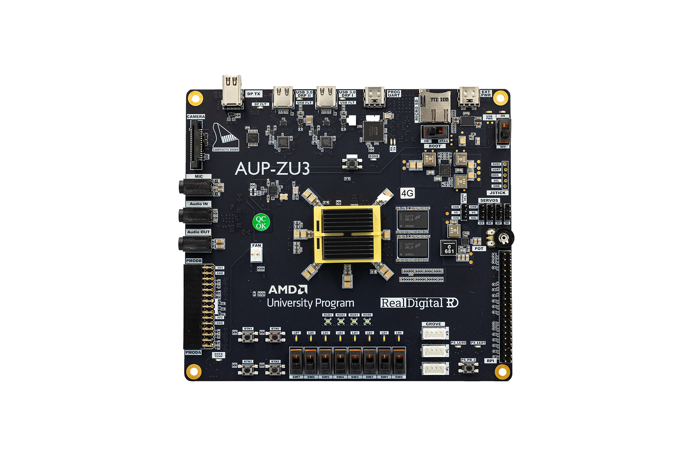
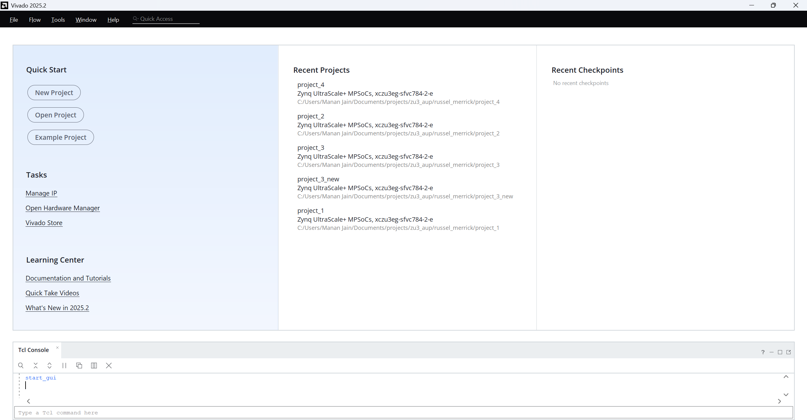
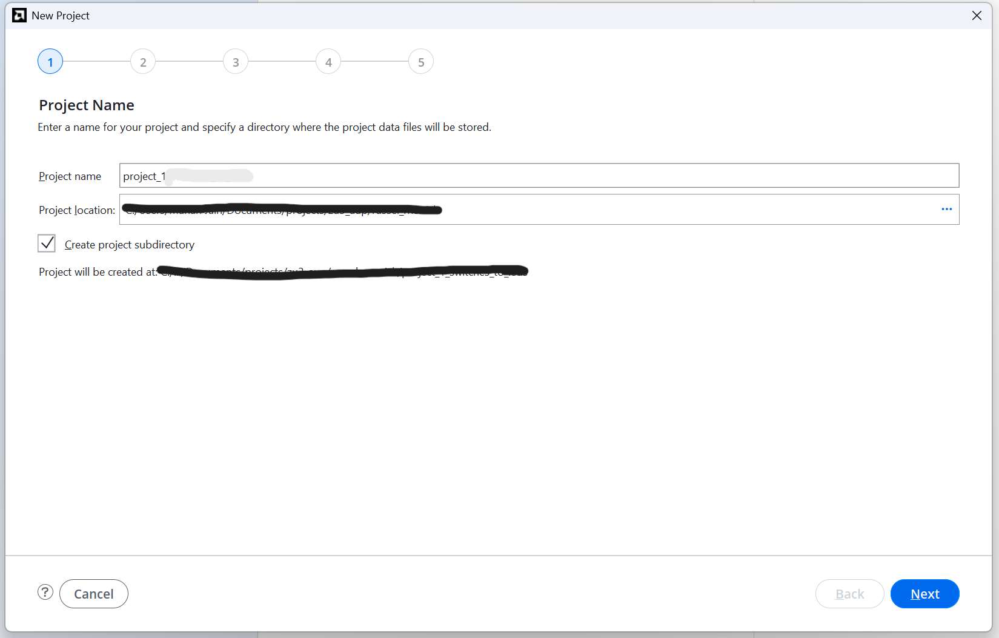
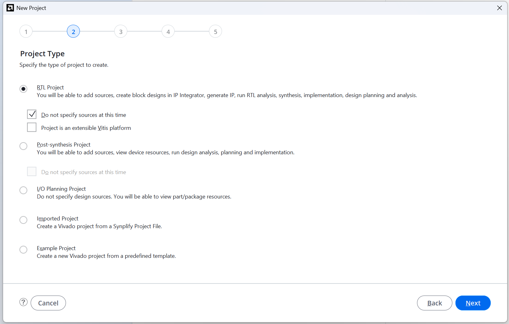
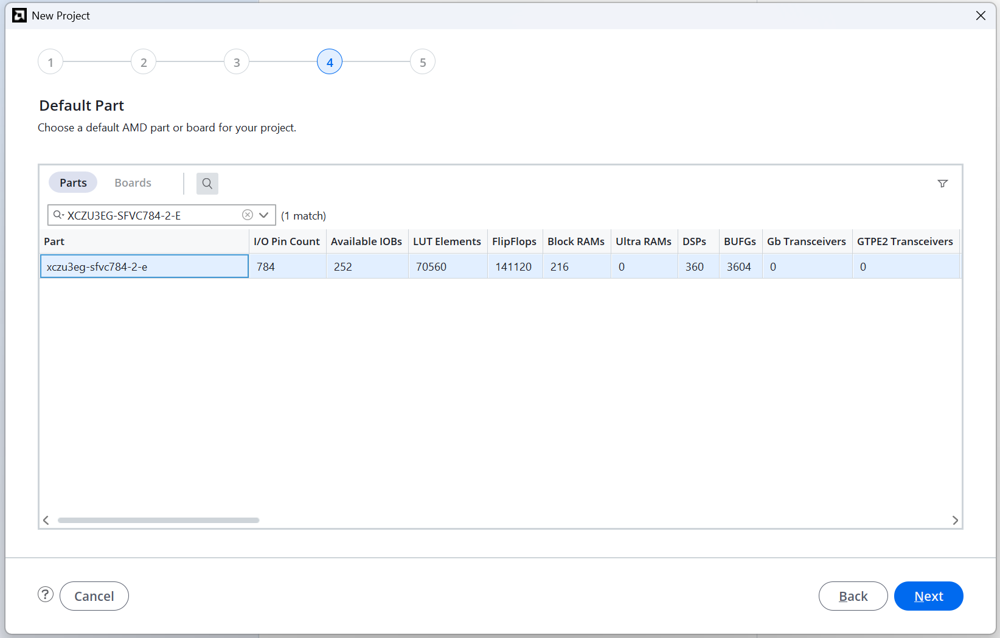
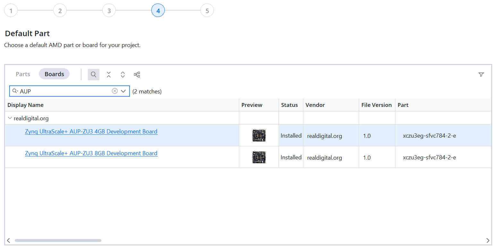
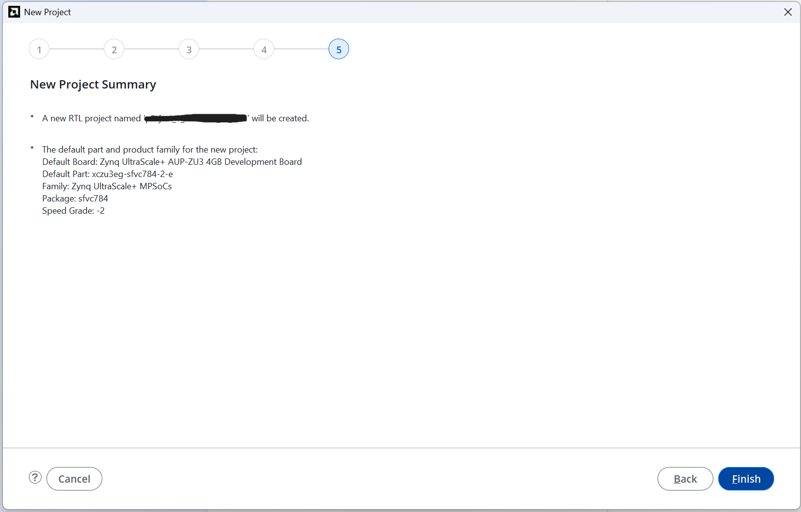

<!-- markdownlint-disable-file MD033 MD013 MD003-->
# Getting Started with FPGAs

Follows the book "GETTING STARTED WITH FPGAS" by "Russell Merrick", hereafter referred to as the book.

FPGA used: AMD (Xilinx) `AUP-ZU3` (Real Digital) <br>
Device Name (Default Part Name): `XCZU3EG-SFVC784-2-E` <br>
Tool Used:  `Vivado 2025.2` (free tier) on Windows 11 Home

Other Tools: [DigitalJS](https://digitaljs.tilk.eu/), [RapidRTL](https://www.rapidrtl.com/) as online compilers to check design synthesis/schematics for ASICs for comparision wherever needed.

AUP-ZU3 Board:


General Rules:

1. Following Little Endianness - LSB is the bit with lowest index value
2. All the code is in SystemVerilog (its a superset of Verilog and verilog code will also work)
3. All the constraint files are  in `.xdc` format - for compatibility to Vivado and added before running synthesis
4. Optional Testbenches are used to ensure functionality before programming the FPGA to ensure that Hardware is not damaged in the process
5. Referenced the [zu3.xdc](/docs/zu3.xdc) file from realdigital.org for the AUP-ZU3 Board to write the constraint files
6. Preference to Synchronous resets as mentioned in AMD Documentation
7. Will make use vio (virtual input and output) and ILA (integrated Logic Analyzer), wherever needed. Have decided not to use it for the basic projects.
8. Preference to built in Clocking Wizard for changing clock frequency.

---

## Starting a new Project

Open Vivado


Start a New Project: give the project a name, select the directory or location, and whether you want to create a new sub-directory for the project or not.


Select Project type: RTL Project. I have selected to add my sources later


Select the default part (board or the silicon) <br>
Since I did not want to add the sources at this stage, the tool skipped step 3


You either select the part or the board, not both. <br> If you have not added board files to vivado or are having trouble with it, you can safely use the part selection, over the board selection.

I will be using the board selection for my projects.

Check if everything is summarised correctly at the last step before finishing and starting to work in the project


---

## Generate Bitstream & Program Harware Demonstration

(Click on image to go to video demo)<br>
[](https://youtu.be/wjTXPKl22pU)

---

## [Project-1: Wiring Switches to LEDs](project_1/README.md)

When you press one of the push button switches, one of the LEDs should light up.

**Learnings: Project-1**:

- Writing SystemVerilog Code
- Writing Physical Constraints
- Implementation & Writing Bitstream to hardware

[Demo Video](https://youtube.com/shorts/nrHFqv3ak0E?feature=share)

---

## [Project-2: Lighting an LED with Logic Gates](project_2/README.md)

When you change input through slide switches, the output changes, according to the logic

**Learnings: Project-2**:

- Writing Testbenches and running behvioural simulation
- Running Linter
- Reading Synthesis Report & checking utilization

[Demo Video](https://youtube.com/shorts/see_1Q9hq7s?feature=share)

---

## [Project-3: Blinking an LED](/project_3_new/README.md)

When the user presses and releases the push button, the LED toggles. It is a sequencial logic circuit, as it registers the press of the button and its release to trigger toggling.

**Learnings: Project-3**:

- Using clocking wizard to generate a 10MHz clock

[Demo Video](https://youtu.be/WUblVmYnfNk)

---

**Note:** Moving ahead all port declarations for the main logic module (not refering to the top module) will use `in_` prefix for input, and `out_` prefix for output ports.  

---

## [Project-4: Debouncing a Switch](project_4/README.md)

Despite the slower clock, we could still see the Project-3 setup glitch. So we will be debouncing that switch and making the clock slower by using a counter circuit.

**Learnings: Project-4**:

- Reason for gliches in inputs from switches
- Deboucing a switch

[Demo Video](https://youtu.be/gVNNTs2BxKI)

## Basic Building Blocks

Commonly used building blocks of digital logic:

- Multiplexer: A mux takes multiple inputs, and gives one output. We have made a 4:1 mux. It takes 4 inputs, and has a 2 select line, and a single bit output.
- Demultiplexer: A demux takes a single input and gives multiple outputs. We have implemented a 1:4 demux. It takes one input, has 2 select lines, and has 4 output lines.
- Shift Register: N number of flip flops chained together, where the output of 1st flip flop is the input to the next flip flop.
- Linear Feedback Shift Register: When certain flip flops of the shift registers are tapped into and thier output is used as input for either an XOR or an XNOR gate. The output of this gate is then fed back to the input of the beginning of the shift register.
- Up Counter: A counter is used to count to a particular value, and then restart from the initial value again. We can configure it based on our needs (skip specific numbers or a certain set of number, count in a specific code - binary, gray, etc.).
- Memory: Mainly made from Flip Flops, or RAM (SRAM or DRAM), when talking about volatile memory.
  - RAM: Bigger memory sets in a specific configuration, that can be accessed *randomly* at the positive edge of a clock cycle.
  - FIFO: The data written first is accessed first.
    - Synchronous FIFO: Data written and read using syncronous clock and in same clock domain
    - Asynchronous FIFO: There are two clocks involved, where read clock can be faster or slower in comparison to write clock. This FIFO is primarily used to share data between components of diferent clock domains.

**Note**: While *Asynchronous FIFO* was only discussed in the book, after a few different iterations (including a block level approach (using counters for pointers, exchanging pointers via 2- flip flop syncronizers, bin2gray code converters and comparaators); using a write always block, a read always block, and using a modulo-counter for resetting pointers), the current design was made to explore the next step to the sync_fifo.

<!-- 
### Multiplexer

A mux takes multiple inputs, and gives one output. We have made a 4:1 mux. It takes 4 inputs, and has a 2 select line, and a single bit output.

### Demultiplexer

A demux takes a single input and gives multiple outputs. We have implemented a 1:4 demux. It takes one input, has 2 select lines, and has 4 output lines.

### Shift Register

### LFSR - Linear Feedback Shift Register

### Up Counter

### Memory

#### RAM

#### FIFO
 -->

---

## Project-5: Selectively Blinking an LED
<!-- ## [Project-5: Selectively Blinking an LED](project_5/README.md) -->

**Learnings: Project-5**:

- Timing Constraints in `.xdc` file
- Addition of clock contraint `create_clock`
- Using buffers (`IBUFDS` & `BUFG`) from *template* to the design
- Clock division using `lfsr`

```tcl
create_clock -name <clk_name> -period 10.000 [get_ports <sys_clk>]
```

[Demo Video](https://youtu.be/IWhE_IEfWbI)

---

## Planned additions

per-project READMEs with resource utilization reports and implementation images.
