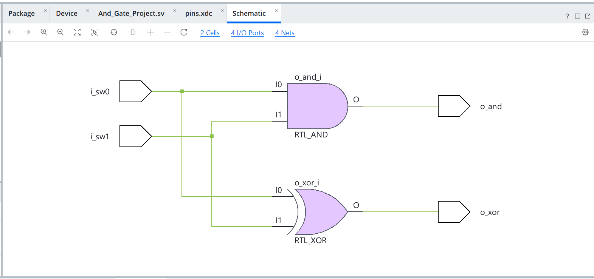
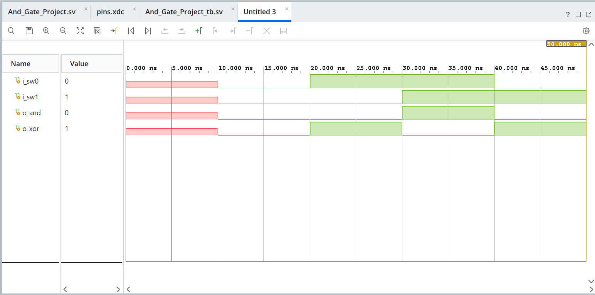
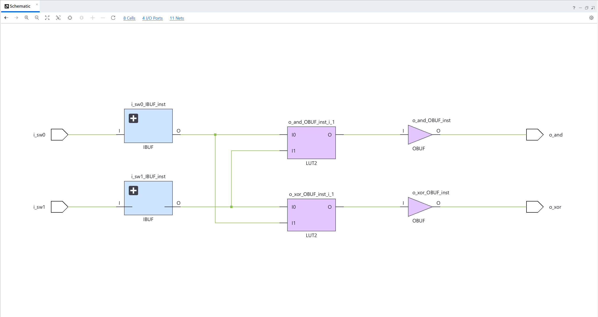
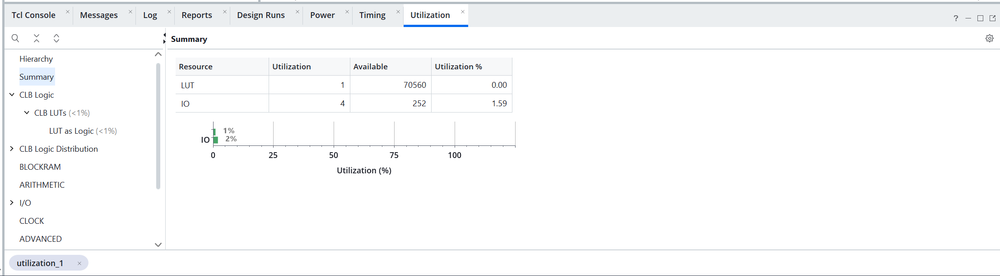

<!-- markdownlint-disable-file MD033 MD013 MD003-->
# Project-2: Lighting an LED with Logic Gates

## Project Overview

- User can change the input via slider switches: sw0, sw1.
- These switches both drive the two gates, `and`, and `xor`.
- In turn, the ouput of these gates, drive one led, each.

**Project Structure**:

```txt
project_2.srcs
|---- sources_1/new/And_Gate_Project.sv     # top level design
|---- constrs_1/new/pins.xdc        # constraint file
|---- sim_1/new/And_Gate_Project_tb.sv      # testbench for simulation
```

### Design Decisions

- Implement `and`, `xor` gates instead of just and gate for more fun <br>
- Use slider switches for input port and led for output port. <br>
- The ouputs follow the following order going from leftmost (msb) led to the rightmost (lsb) led [XOR, AND] <br>

---

## Linter

### Linter Output

``` tcl
RTL Linter Report

Table of Contents
-----------------
1. Summary

1. Summary
----------

+---------+----------+--------------+----------+
| Rule ID | Severity | # Violations | # Waived |
+---------+----------+--------------+----------+


INFO: [Synth 37-85] Total of 0 linter message(s) generated.
INFO: [Synth 37-45] Linter Run Finished!
```

### Post Elaboration Schematic



---

## Behavioural Simulation

### Waveform



### Simulation Log

```tcl
Time resolution is 1 ps
| Time = 0 | in1 = x | in2 = x | and = x | xor = x |
| Time = 10 | in1 = 0 | in2 = 0 | and = 0 | xor = 0 |
| Time = 20 | in1 = 1 | in2 = 0 | and = 0 | xor = 1 |
| Time = 30 | in1 = 1 | in2 = 1 | and = 1 | xor = 0 |
| Time = 40 | in1 = 0 | in2 = 1 | and = 0 | xor = 1 |
$finish called at time : 50 ns
```

---

## Synthesis

### Synthesis Report Log

```tcl
Start Writing Synthesis Report
---------------------------------------------------------------------------------

Report BlackBoxes: 
+-+--------------+----------+
| |BlackBox name |Instances |
+-+--------------+----------+
+-+--------------+----------+

Report Cell Usage: 
+------+-----+------+
|      |Cell |Count |
+------+-----+------+
|1     |LUT2 |     2|
|2     |IBUF |     2|
|3     |OBUF |     2|
+------+-----+------+
---------------------------------------------------------------------------------
Finished Writing Synthesis Report : Time (s): cpu = 00:00:30 ; elapsed = 00:00:31 . Memory (MB): peak = 2851.500 ; gain = 1302.223
---------------------------------------------------------------------------------
Synthesis finished with 0 errors, 0 critical warnings and 0 warnings.
```

### Post-Synthesis Schematic



---

## Implementation

### Utilization



---

<!-- ## Programming the FPGA & Observing the Outputs -->
## Planned Updates

- Programming the FPGA.
- Demonstarion of the implementation (either images or video).

---

## *Reference*

- Project#2, Chapter-3 of the book
- *Testbench*: page 72, Chapter-5 of the book
